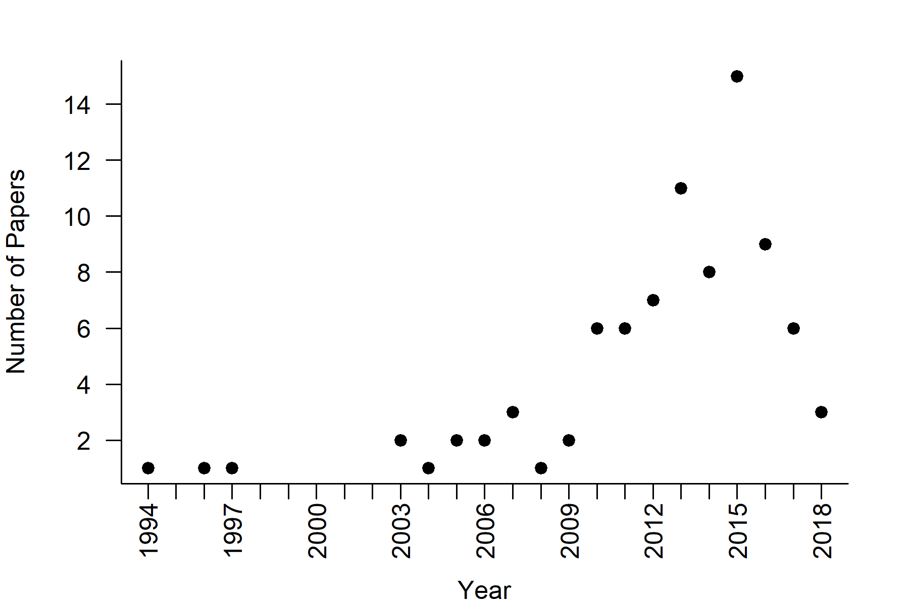

# Literature Review

I performed a search on Web of Science for "quantitative gen$*$" AND behavio$*$ on 23 January 2018 and emailed all fo the results to myself. I copied the text of those emails into a text file and used my program `parse_wos` to extract the relevant fields: Publication type (PT), Full source title (SO), Authors (AU), Title (TI), Volume (VL), Publication year (PY), and abstract (AB). `parse_wos` output these fields as the columns of a tab-delimited file. 

```{r setup, include=FALSE}
knitr::opts_chunk$set(echo = TRUE,out.extra='',fig.pos="H")
knitr::opts_knit$set(root.dir='../qgb_data/')
```
```{r original_file}
source("../R/literature-review.R")
library(knitr)
orig.file<-data.frame(read.delim("qgb.txt",sep='\t',quote=""),stringsAsFactors = FALSE)
```

The web of science search resulted in `r nrow(orig.file)` publications, which I saved in an Excel file and uploaded to Google Drive. In Google Drive I added columns to facilitate categorization and annotation of each abstract, and I added abstracts to those that did not have abstracts exported from Web of Science, when possible. Additionally, I removed any entries that did not pertain to evolutionary quantitative genetics and ignored studies on humans.

```{r annotated_file}
qgb<-data.frame(read.csv("qgb.csv",header = TRUE),stringsAsFactors = FALSE)
qgb<-qgb[qgb$Human != "human",]
qgb<-search_line(c("none","not relevant","not behavior","not a behavior","not quantitative genetics","meeting abstract",
                       "not useful","plant","no abstract","just the abstract"),"Relevance.to.article",qgb,inverse = TRUE)
```

This annotated file contained `r nrow(qgb)` entries after the pruning mentioned above. 

```{r separate_synth}
synth<-c(grep("review",qgb$Methods), grep("synthesis",qgb$Methods),grep("meta.*analysis",qgb$Methods),
           grep("position p.*",qgb$Methods), grep("commentary",qgb$Methods), grep("intro.*issue",qgb$Methods))
syn<-qgb[synth[!duplicated(synth)],]
exp<-qgb[-synth[!duplicated(synth)],]
models<-c(grep("^model",exp$Methods),grep("stats",exp$Methods),grep("mathematical",exp$Methods),grep("statistical",exp$Methods),
           grep("evolutionary model",exp$Methods),grep("theoretical model",exp$Methods), grep("simulation model",exp$Methods),
           grep("game theoretic model",exp$Methods))
mod<-exp[models[!duplicated(models)],]
exp<-exp[-models[!duplicated(models)],]
```

Of those, `r nrow(syn)` were review, synthesis, commentaries, and meta-analyses. `r nrow(mod)` papers were theoretical or statistical models, and the remaining `r nrow(exp)` were laboratory or field estimates of quantitative genetic parameters of behavioral phenotypes. 

## Categories

Of the experimental ones, how do they break down into categories? These categories are not mutually exclusive, and any one study may belong to multiple categories.

```{r categories}
cats<-apply(exp[,16:(ncol(exp)-1)],2,function(c){ length(c[c!=""])})
kable(cats[order(cats,decreasing = TRUE)],col.names = "Number of studies")
write.table(cats[order(cats,decreasing = TRUE)],"QGB_categories.csv",sep=",")
```

"Reproduction and Fecundity" includes reproductive success and reproductive strategies, such as asexual/sexual/hermaphroditic sexual systems, monogamy vs polygyny, alternative mate choice tactics, oviposition/nesting preferences and timing, egg and milk production traits, physiological effects of mating, and other fecundity-related phenotypes. "Mate choice and sexual selection" includes pre and postcopulatory selective episodes as well as elements of display traits (e.g., male song in crickets) and female preferences. 

Clearly personality traits have been widely studied.

## Species

How are these studies distributed across species/taxa/classes?

```{r species}
kable(table(factor(exp$species))[order(table(factor(exp$species)),decreasing = TRUE)],col.names = c("Species name","Number of studies"))
kable(table(factor(exp$common.name))[order(table(factor(exp$common.name)),decreasing = TRUE)],col.names = c("Common name","Number of studies"))
kable(table(factor(exp$Class))[order(table(factor(exp$Class)),decreasing = TRUE)],col.names = c("Class","Number of studies"))

# Creating a table in the format that I want, with class and species and number of studies.
spp<-data.frame(table(factor(exp$species))[order(table(factor(exp$species)),decreasing = TRUE)])
colnames(spp)<-c("Species","Number.of.studies")
spp$Class<-unlist(lapply(spp$Species,function(sp,df){
  unique(df[df$species %in% sp,"Class"])
},df=exp))
cls<-data.frame(table(factor(exp$Class))[order(table(factor(exp$Class)),decreasing = TRUE)])
colnames(cls)<-c("Class","Number.of.studies")
cls<-data.frame(Species="All",Number.of.studies=cls$Number.of.studies,Class=cls$Class,stringsAsFactors = FALSE)
spcl<-data.frame(rbind(spp,cls),stringsAsFactors = FALSE)
write.table(spcl[order(spcl$Class,spcl$Number.of.studies,decreasing=TRUE),c(3,1,2)],"qgbSpeciesClass.csv",row.names=FALSE,sep=",")

```

## Experimental design

What experimental designs were used, and how frequently?

```{r exp_design}


```

## Personality

Let's focus on personality studies

```{r personality}
pers<-qgb[qgb$Personality!="",]
synth<-c(grep("review",pers$Methods), grep("synthesis",pers$Methods),grep("meta.*analysis",pers$Methods),
           grep("position p.*",pers$Methods), grep("commentary",pers$Methods), grep("intro.*issue",pers$Methods))
psyn<-pers[synth[!duplicated(synth)],]
pexp<-pers[-synth[!duplicated(synth)],]
models<-c(grep("^model",pexp$Methods),grep("stats",pexp$Methods),grep("mathematical",pexp$Methods),grep("statistical",pexp$Methods),
           grep("evolutionary model",pexp$Methods),grep("theoretical model",pexp$Methods), grep("simulation model",pexp$Methods),
           grep("game theoretic model",pexp$Methods))
pmod<-pexp[models[!duplicated(models)],]
pexp<-pexp[-models[!duplicated(models)],]

```

Of those, `r nrow(psyn)` were review, synthesis, commentaries, and meta-analyses. `r nrow(pmod)` papers were theoretical or statistical models, and the remaining `r nrow(pexp)` were laboratory or field estimates of quantitative genetic parameters of behavioral phenotypes. 

```{r personality_species}
kable(table(factor(pexp$species))[order(table(factor(pexp$species)),decreasing = TRUE)],col.names = c("Species name","Number of studies"))
kable(table(factor(pexp$common.name))[order(table(factor(pexp$common.name)),decreasing = TRUE)],col.names = c("Common name","Number of studies"))
kable(table(factor(pexp$Class))[order(table(factor(pexp$Class)),decreasing = TRUE)],col.names = c("Class","Number of studies"))
```

```{r personality_time}
pery<-data.frame(table(pers$PY))
colnames(pery)<-c("Year","NumPapers")

png("figs/Personality_Timeline.png",height=4,width=6,units="in",res=300)
par(mar=c(4,4,2,2))
plot(as.numeric(as.character(pery$Year)),pery$NumPapers,bty='l',xlab="Year",ylab="Number of Papers",
     xaxt='n',pch=19,las=1)
axis(1,at=seq(min(as.numeric(as.character(pery$Year))),max(as.numeric(as.character(pery$Year)))),labels = NA)
text(x=seq(min(as.numeric(as.character(pery$Year))),max(as.numeric(as.character(pery$Year))),3),y=-1.25,
     xpd=TRUE,srt=90,labels = seq(min(as.numeric(as.character(pery$Year))),max(as.numeric(as.character(pery$Year))),3))
dev.off()
```



Can I pull out studies that estimated heritability? I think I have to go through the papers themselves to do that.

```{r personality_heritability}
pers.h2<-search_line(c("heritability"," h ","h2"),"AB",pexp)
pers.not.h2<-search_line(c("heritability"," h ","h2"),"AB",pexp,inverse = TRUE)

```

# Creating demonstration figures

